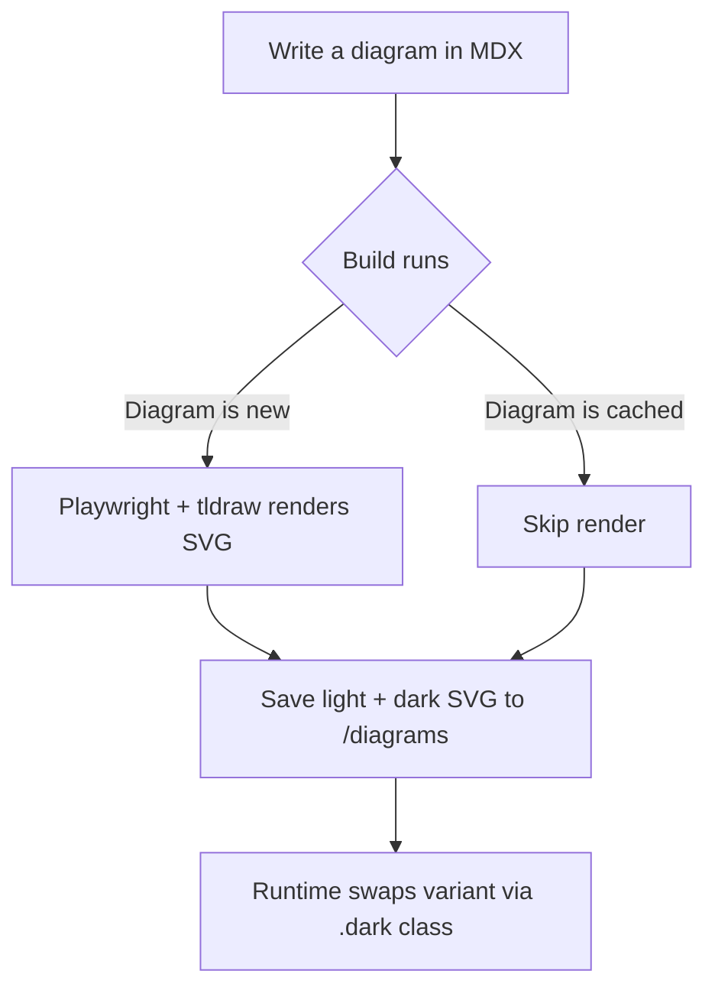
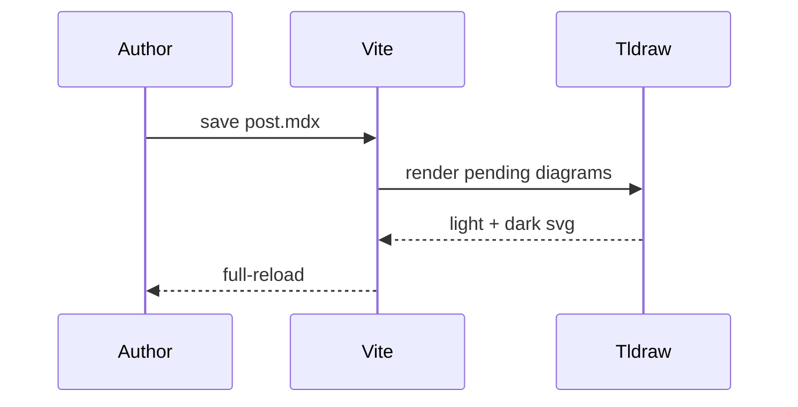
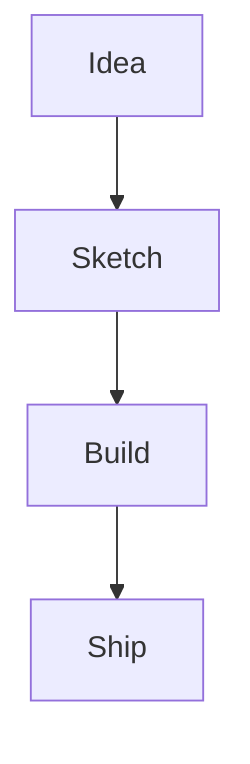

Sometimes a diagram is the fastest way to say a thing. Here's a basic flowchart:

A simple sequence diagram works too — tldraw doesn't natively model these, so
the harness falls back to mermaid's own SVG output:

You can cap the width per-diagram with a fence meta option, handy for tall
top-down charts:

