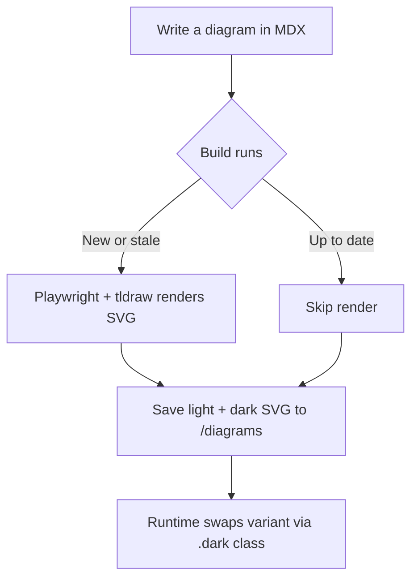
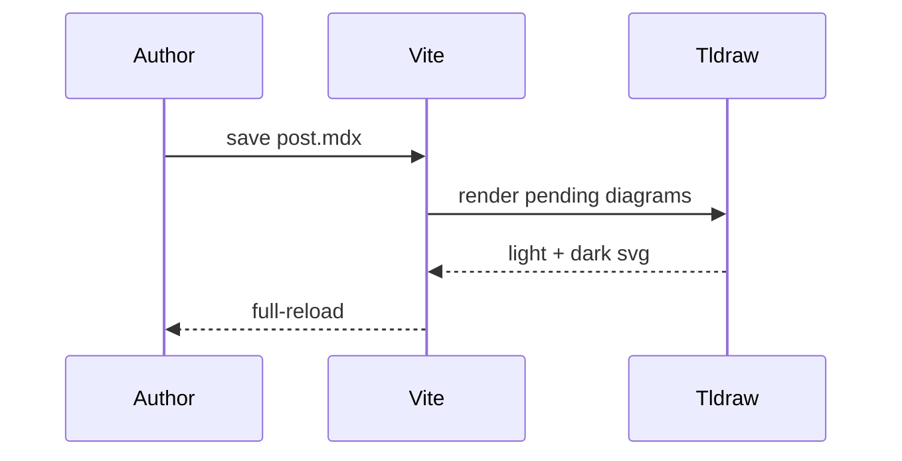
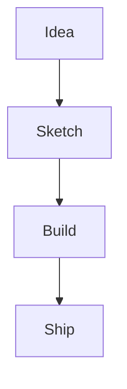

Diagrams are one of those things where the gap between "I want a diagram here" and "there is a diagram here" is just annoying enough to make me skip it entirely. [Mermaid](https://mermaid.js.org) solves the authoring side — write plain text, get a chart — but the default SVG output is serviceable rather than beautiful. And I'd been using tldraw for whiteboarding anyway, so I kept wondering if I could pull the two together.

It turns out you can — and the credit for figuring out how goes to [Sunil Pai](https://x.com/threepointone/status/2066481114949046693), who shipped a plugin for his blog that does exactly this, complete with light and dark variants. He even pointed at [the commit](https://github.com/threepointone/sunilpai-dev/commit/f4bd28a11a6eb4d9f514f13df35d4ca340f5d8d3) where it all lives. What follows is me retracing his steps for this site, with a few detours of my own along the way.

The version running here works like this: you write a plain mermaid fence in an MDX post, and at build time a Playwright harness renders it through tldraw, writes light and dark SVG variants to `public/diagrams/`, and embeds them via a manifest the runtime looks up. The worker bundle ships zero bytes of mermaid or tldraw code. Here's what the whole thing looks like:



## The architecture

There are four moving parts:

1. **The harness** — a Vite dev server that serves a page mounting `<Tldraw>` and exposing `window.renderMermaid(source, opts)`.
2. **The render script** — a Node script that walks `posts/**/*.mdx`, extracts mermaid blocks, decides what's stale, then drives the harness via Playwright to get SVG strings back.
3. **The manifest** — `app/mdx/mermaid-manifest.json`, a flat `{normalizedSource: hash}` map the SSR runtime can import.
4. **The runtime hook** — `app/mdx/mdx-hooks.tsx`, a `renderNode` override that intercepts mermaid code nodes and emits a `<figure>` with two `` tags.

A Vite plugin (`lib/mermaid-plugin.ts`) wires it into the dev loop: post edits trigger an in-process re-render and a full browser reload; harness or style config edits trigger a full server restart so the bundled render code actually reloads.

## Hashing for stable URLs

Each diagram's output filename is a content hash, so URLs are stable across re-renders and external links don't 404. But there's a wrinkle: when you change your styling code, the hash doesn't change, so cached SVGs won't be re-rendered even though they'd look different.

The fix is a render marker embedded inside each SVG as an HTML comment:

```ts
export const RENDER_REVISION = `tldraw-5.1.1-r6`
export const renderVersion = (style: string) => `${RENDER_REVISION}-${style}`
// → <!-- tldraw-mermaid render:tldraw-5.1.1-r6-sleek -->
```

The renderer checks the marker in any existing file before deciding to skip it. The version string combines the tldraw package version, a manual revision counter, and the diagram's style name. Bumping the revision (`r6` → `r7`) invalidates everything without changing any filenames. External links stay valid. The revision is cheap to bump and free to ignore when nothing style-related has changed.

One gotcha I hit: I bumped the version mid-iteration but cached SVGs still showed the previous value, because I'd changed the style name earlier and the marker already said "indigo." The renderer thought everything was current. Lesson learned — bump *before* you start tuning, not after.

## The harness

`scripts/mermaid/harness.tsx` mounts a full `<Tldraw>` instance in a blank page and hangs a function off `window`:

```ts
window.renderMermaid = async (source: string, opts: RenderOpts) => {
  const { shapes } = await createMermaidDiagram(source)
  editor.createShapes(shapes)
  // … select all, export SVG, clean up
  return { light: lightSvg, dark: darkSvg }
}
```

`@tldraw/mermaid`'s `createMermaidDiagram` converts a mermaid string into tldraw shape descriptors — geo nodes for boxes and diamonds, arrow shapes for edges. For diagram types it doesn't model natively (sequence diagrams, Gantt charts), it calls an `onUnsupportedDiagram` callback that falls back to mermaid's own SVG renderer.

The render script launches a Playwright page, navigates it to `http://localhost:<port>/harness.html`, waits for a `window.__harnessReady` flag, then calls `window.renderMermaid` for each pending block:

```ts
const { light, dark } = await page.evaluate(
  ([src, opts]) => window.renderMermaid(src, opts),
  [source, opts] as const
)
```

## The manifest as a source→hash bridge

`node:crypto` doesn't run in Cloudflare Workers, and `SubtleCrypto` is async and adds overhead to every request. So we can't recompute hashes at SSR time. Instead, the build emits `app/mdx/mermaid-manifest.json` keyed by normalized source string — the same content that was hashed, normalized to trim whitespace and unify line endings:

```json
{
  "flowchart TD\n  A[Write...] --> B{Build...}": "a3f8c2d1",
  "sequenceDiagram\n  participant Author...": "b9e4a771"
}
```

The runtime hook imports this JSON and looks up the hash:

```ts
import manifest from '~/mdx/mermaid-manifest.json'

const hash = manifest[normalizeSource(node.value)]
if (!hash) return null // fall back to plain code block

return (
  <figure className="mermaid-diagram">
    
    
  </figure>
)
```

## Styling

tldraw defaults give you the hand-drawn look with `draw` font and sketchy strokes. That's tldraw's whole thing and it's lovely, but it didn't feel right for technical diagrams. First real pass: `font: "mono"`, `dash: "solid"`, `fill: "none"`, `size: "m"` on every shape.

That was better. Then I noticed arrows exported thinner than shape outlines at the same `size: "m"`. Turned out the `size` token maps to different stroke widths depending on shape type — arrows came out at roughly 3.5 wide, geo shapes at 4.5. I bumped arrows to `size: "l"` to compensate, which gave stroke-width 5. Too thick.

tldraw's size tokens are fixed — `s`, `m`, `l`, `xl`, no half-steps. So I added an SVG post-processing step: after export, swap the 5 for a 4. It sits between the two and the outlines feel balanced:

```ts
const svg = rawSvg.replaceAll('stroke-width="5"', 'stroke-width="4"')
```

For color, I wanted the diagrams to match the site's indigo palette — `#4f46e5` in light mode, `#a5b4fc` in dark mode, same as the prose link colors in `app/global.css`. Another post-processing pass replaces tldraw's default colors. The tricky part was hierarchy: I wanted arrows and text to read clearly, but shape outlines slightly softer. My first attempt used a second, lighter indigo for outlines. Cleaner answer: same hex, lower `stroke-opacity`. Automatically lighter without maintaining a second color:

```ts
transformSvg: (svg: string) => svg
  .replaceAll(TLDRAW_DEFAULT_STROKE, INDIGO)
  .replaceAll('stroke-opacity="1"', 'stroke-opacity="0.7"')
```

All of this lives in a `STYLES` map in `harness.tsx` with a `shapeProps`, `arrowProps`, and `transformSvg` per style. Switching styles means changing one line in `scripts/mermaid/style-config.ts`:

```ts
export const ACTIVE_STYLE = "indigo"
```

That string flows through to the version marker via template literal, so a style swap automatically invalidates the cache. It's isomorphic, too — you can import it from both the Node render script and the browser harness without issues.

## The dev loop

Post edits re-render just the changed diagrams in-process and trigger a full browser reload. Fast enough that it doesn't feel like a build step.

Harness edits or style config edits are a different story. The render script gets bundled into the Vite config chain at startup — it's not re-evaluated on the fly. The only clean way to reload it is `server.restart()`. The plugin watches `scripts/mermaid/**` and `scripts/render-mermaid.ts` and calls `server.restart()` when they change. Slightly slower, but you're not touching those files during normal writing anyway.

The `await import("../scripts/render-mermaid")` in the plugin is a dynamic import deliberately. If it were static, esbuild would inline Playwright, Vite, and `@vitejs/plugin-react` into the compiled `vite.config.ts`, and the Cloudflare Vite plugin would chase that dependency graph and throw on `node:worker_threads`. Dynamic import keeps the bundle clean.

## Sequence diagrams and the fallback path

`@tldraw/mermaid` supports flowcharts and a handful of other types, but not sequence diagrams. Here's what one looks like — this one falls through to mermaid's own SVG renderer via `onUnsupportedDiagram`:



The fallback output is mermaid's default SVG, which looks different from the tldraw ones. I'm treating this as a feature for now — sequence diagrams have a different visual character anyway. But it's worth knowing the boundary exists.

## Per-fence meta options

Fences carry meta options after the language tag. Two are wired up: `width` caps the display size, and `style` picks a different preset from the `STYLES` map. The diagram below sets both — it's capped narrow *and* rendered with the `sleek` preset (tldraw's default ink instead of the site's indigo), so you can see it sitting next to the indigo diagrams above:



`width` and `style` travel through the pipeline by different routes, because they change different things. `width` is purely presentational, so `parseMetaString` in `app/mdx/mdx-hooks.tsx` reads it at runtime and sets an inline `max-width` on the figure — the SVG itself is identical. `style` changes the *pixels*, so it has to be resolved at render time: `extractMermaidBlocks` reads it off each fence, the render script hands it to `window.renderMermaid(source, opts, style)`, and the harness looks it up in `STYLES`. The runtime never needs to know — it still maps source → hash → SVG, and the styled output is already baked into the file.

The one subtlety is cache invalidation. The filename hash is source-only (for stable URLs), so swapping a fence's style wouldn't change the filename. Instead the active style is baked into each SVG's render marker (`…-r6-sleek` vs `…-r6-indigo`), so changing `style="..."` makes the marker mismatch and that one diagram re-renders in place — everything else stays cached.

## What the CSS looks like

The display swap is just CSS. Two images, default hidden, one shown per theme:

```css
.mermaid-diagram {
  max-width: 36rem;
}

.mermaid-light { display: block; }
.mermaid-dark  { display: none;  }

.dark .mermaid-light { display: none;  }
.dark .mermaid-dark  { display: block; }
```

The `.dark` class on the `<html>` element is already managed by the site's theme system, so this just works.

## What to play with next

The `STYLES` map is the obvious place to start experimenting — different fonts, fill styles, different brand colors. Each style entry is self-contained with its own `shapeProps`, `arrowProps`, and `transformSvg`, so you can add a new one without touching anything else. Once it's in the map, any fence can opt into it with `style="yourstyle"` (see the per-fence meta options above).

And if you want finer control over the fallback path, `onUnsupportedDiagram` gets the raw mermaid source and can do anything with it — custom renderers, a placeholder, a hard error. Currently it just calls back into mermaid's own library, which is fine.

The part I like most is that the author experience stays completely boring. Write mermaid, save the file, see a diagram. The pipeline is only visible when something goes wrong, which is exactly where you want complexity to live.
